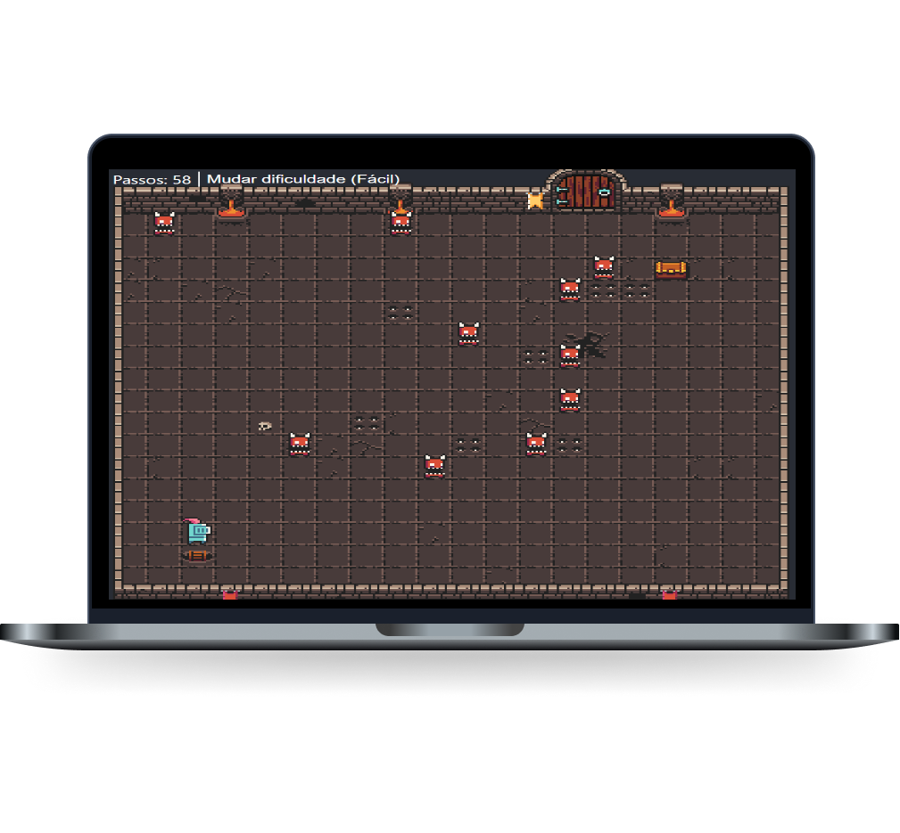

  

## 🚀 Heroku Deploy

Play the game here: [https://game-using-js.herokuapp.com/](https://renanspr.github.io/javascript-game/)

## ⚙ Technologies

This project was developed with the following technologies:

- Javacript
- HTML5
- CSS3

## 💻 Project

Game developed during the week Heroway Brasil. I created new features like steps counter and select difficulty.

## 🎮 How to play

You need to get your hero to the chest before your steps are over, avoiding traps and mini demons. Use WASD or arrow keys to move your hero.

## :memo: License

This project is under the MIT license. 
